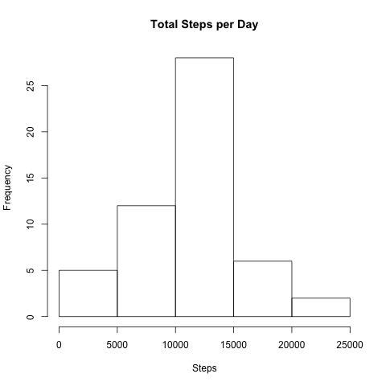
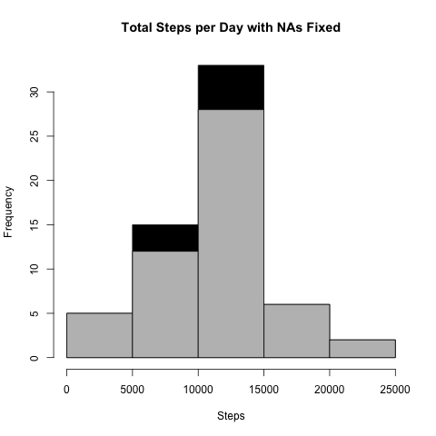
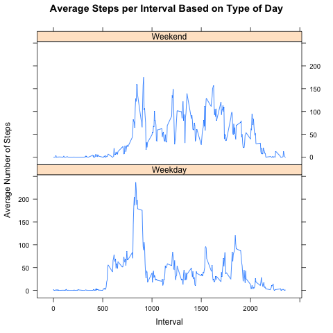

## Loading and preprocessing the data

```{r}
## Loading
library(ggplot2)
library(plyr)
activity <- read.csv("activity.csv")

##Processing
activity$day <- weekdays(as.Date(activity$date))
activity$DateTime<- as.POSIXct(activity$date, format="%Y-%m-%d")

##pulling data without nas
clean <- activity[!is.na(activity$steps),]
```

## What is mean total number of steps taken per day?

Calculate the total number of steps taken per day
```{r}
## summarizing total steps per date
sumTable <- aggregate(activity$steps ~ activity$date, FUN=sum, )
colnames(sumTable)<- c("Date", "Steps")
```

Make a histogram of the total number of steps taken each day
```{r, echo=TRUE}
## Creating the historgram of total steps per day
hist(sumTable$Steps, breaks=5, xlab="Steps", main = "Total Steps per Day")
```
 

Calculate and report the mean and median of the total number of steps taken per day
```{r}
## Mean of Steps
as.integer(mean(sumTable$Steps))

## Median of Steps
as.integer(median(sumTable$Steps))
```

The average number of steps taken each day was 10766 steps.

The median number of steps taken each day was 10765 steps.

## What is the average daily activity pattern?

Make a time series plot (i.e. type = “l”) of the 5-minute interval (x-axis) and the average number of steps taken, averaged across all days (y-axis)

```{r, echo=TRUE}
library(plyr)
library(ggplot2)
##pulling data without nas
clean <- activity[!is.na(activity$steps),]

##create average number of steps per interval
intervalTable <- ddply(clean, .(interval), summarize, Avg = mean(steps))

##Create line plot of average number of steps per interval
p <- ggplot(intervalTable, aes(x=interval, y=Avg), xlab = "Interval", ylab="Average Number of Steps")
p + geom_line()+xlab("Interval")+ylab("Average Number of Steps")+ggtitle("Average Number of Steps per Interval")
 

##Maximum steps by interval
maxSteps <- max(intervalTable$Avg)
##Which interval contains the maximum average number of steps
intervalTable[intervalTable$Avg==maxSteps,1]
```

The maximum number of steps for a 5-minute interval was 206 steps.

The 5-minute interval which had the maximum number of steps was the 835 interval.

## Imputing missing values

```{r}
##Number of NAs in original data set
nrow(activity[is.na(activity$steps),])
```

The total number of rows with steps = ‘NA’ is 2304. 

Filling in NAs
```{r,echo=TRUE}
## Create the average number of steps per weekday and interval
avgTable <- ddply(clean, .(interval, day), summarize, Avg = mean(steps))

## Create dataset with all NAs for substitution
nadata<- activity[is.na(activity$steps),]
## Merge NA data with average weekday interval for substitution
newdata<-merge(nadata, avgTable, by=c("interval", "day"))
## Reorder the new substituded data in the same format as clean data set
newdata2<- newdata[,c(6,4,1,2,5)]
colnames(newdata2)<- c("steps", "date", "interval", "day", "DateTime")

##Merge the NA averages and non NA data together
mergeData <- rbind(clean, newdata2)

##Create sum of steps per date to compare with step 1
sumTable2 <- aggregate(mergeData$steps ~ mergeData$date, FUN=sum, )
colnames(sumTable2)<- c("Date", "Steps")
## Mean of Steps with NA data taken care of
as.integer(mean(sumTable2$Steps))
# Median of Steps with NA data taken care of
as.integer(median(sumTable2$Steps))

## Creating the histogram of total steps per day, categorized by data set to show impact
hist(sumTable2$Steps, breaks=5, xlab="Steps", main = "Total Steps per Day with NAs Fixed", col="Black")
hist(sumTable$Steps, breaks=5, xlab="Steps", main = "Total Steps per Day with NAs Fixed", col="Grey", add=T)
legend("topright", c("Imputed Data", "Non-NA Data"), fill=c("black", "grey") )
```
 

The new mean of the imputed data is 10821 steps compared to the old mean of 10766 steps. That creates a difference of 55 steps on average per day.

The new median of the imputed data is 11015 steps compared to the old median of 10765 steps. That creates a difference of 250 steps for the median.

However, the overall shape of the distribution has not changed.

## Are there differences in activity patterns between weekdays and weekends?
```{r, echo=TRUE}
## Create new category based on the days of the week
mergeData$DayCategory <- ifelse(mergeData$day %in% c("Saturday", "Sunday"), "Weekend", "Weekday")

library(lattice)
## Summarize data by interval and type of day
intervalTable2 <- ddply(mergeData, .(interval, DayCategory), summarize, Avg = mean(steps))
##Plot data in a panel plot
xyplot(Avg~interval|DayCategory, data=intervalTable2, type="l",  layout = c(1,2),
       main="Average Steps per Interval Based on Type of Day", 
       ylab="Average Number of Steps", xlab="Interval")
```
 

Yes, the step activity trends are different based on whether the day occurs on a weekend or not. This may be due to people having an increased opportunity for activity beyond normal work hours for those who work during the week.

Reference: rpubs.com/tmd636/102240
